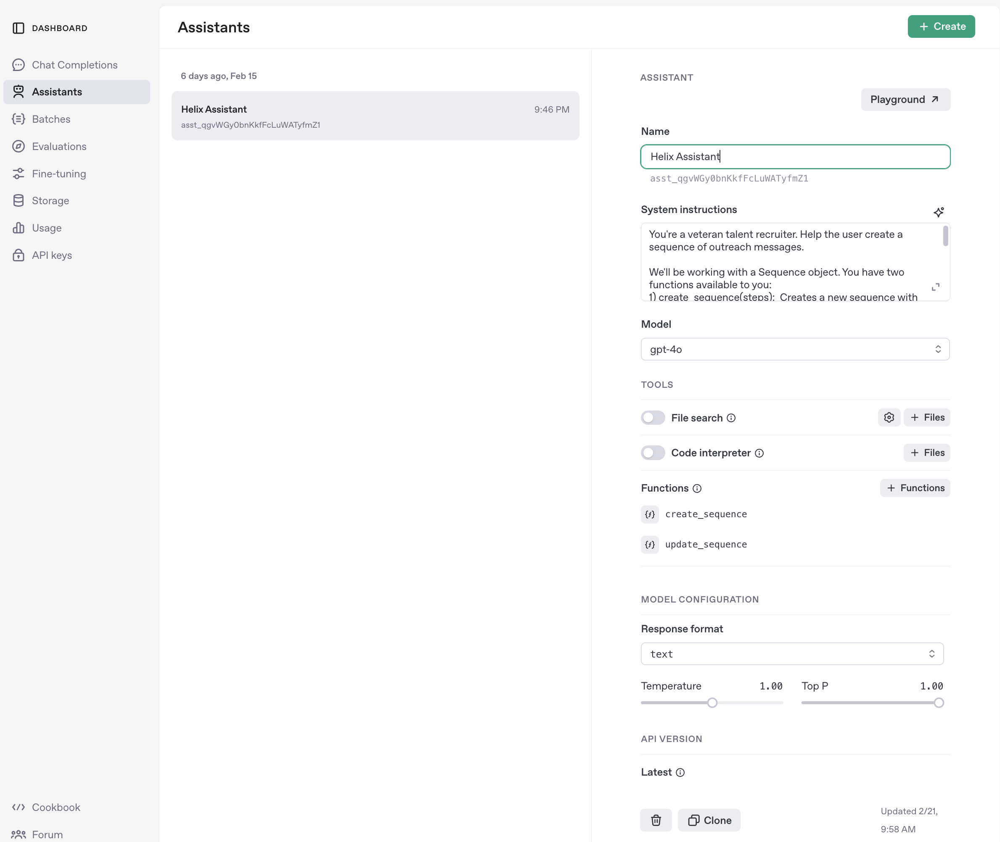

# Helix

## Create the Assistant on openai [OpenAI](https://platform.openai.com/assistants)

You can name the assistant anything. In my example I named it Helix Assistant.



1. Add the following system instructions:

```
You're a veteran talent recruiter. Help the user create a sequence of outreach messages.

We'll be working with a Sequence object. You have two functions available to you:
1) create_sequence(steps):  Creates a new sequence with the provided steps. Returns the a new Sequence object 
2) update_sequence(id, steps): Updates the steps of sequence where id=id. Returns the updated Sequence object.

Before creating or updating a Sequence, make sure the person you're assisting has provided all the information you might need to satisfy their request. If you don't have enough information to create or update the sequence effectively, then ask the user for additional info.

```

2. Register `create_sequence` function with definition:

```json
{
  "name": "create_sequence",
  "description": "Creates a new outreach sequence of outreach messages, inserts the sequence into a database table, and returns the newly created sequence and id",
  "strict": true,
  "parameters": {
    "type": "object",
    "required": [
      "steps"
    ],
    "properties": {
      "steps": {
        "type": "array",
        "description": "Array of sequenced outreach messages.",
        "items": {
          "type": "object",
          "properties": {
            "message": {
              "type": "string",
              "message": "The action to be performed in this step"
            },
            "stepNumber": {
              "type": "number",
              "description": "The order in which this message should sent, where step number 1 is used first."
            }
          },
          "additionalProperties": false,
          "required": [
            "message",
            "stepNumber"
          ]
        }
      }
    },
    "additionalProperties": false
  }
}
```

3. Regiter `update_sequence` function with definition:

```json
{
  "name": "update_sequence",
  "description": "Updates an existing sequence in the database by updating the contents of the steps property.",
  "strict": true,
  "parameters": {
    "type": "object",
    "required": [
      "id",
      "steps"
    ],
    "properties": {
      "id": {
        "type": "number",
        "description": "The primary key for a Sequence"
      },
      "steps": {
        "type": "array",
        "description": "Array of sequenced outreach messages.",
        "items": {
          "type": "object",
          "properties": {
            "message": {
              "type": "string",
              "message": "The action to be performed in this step"
            },
            "stepNumber": {
              "type": "number",
              "description": "The order in which this message should sent, where step number 1 is used first."
            }
          },
          "additionalProperties": false,
          "required": [
            "message",
            "stepNumber"
          ]
        }
      }
    },
    "additionalProperties": false
  }
}
```

## Set up the database (PostgreSQL)

The database uses PostgreSQL with sqlalchemy as the ORM.
In mvp implementation, only message `threads` and outreach `sequences` are stored.

1. Create a database named `helix` in PostgreSQL.

    ```bash
    createdb helix
    ```

## Setting up the server (Flask / Python)

1. **Clone the repository:**

    ```bash
    git clone <repository_url>
    cd Helix/server
    ```

2. **Install dependencies:**

    ```bash
    pip install -r requirements.txt
    ```

3. **Set environment variables:**

    Create a `.env` file in the `server` directory.
    Add your OpenAI API key and Database Url.

   ```bash
   # .env file
   OPENAI_API_KEY=your_api_key_here
   DATABASE_URL=postgresql://localhost/helix
   ```

4. IMPORTANT! In `ai.py`,  update the hardcoded assistant id using the id for your assistant:

    ```python
    assistant_id = "asst_qgvWGy0bnKkfFcLuWATyfmZ1"  # Hardcoded assistant id
    ```

5. **Run the server:**

   ```bash
   Flask run # or Flask run --debug
   ```

   The server will start on `http://localhost:5000`.

## Setting up the Client (React / Javascript)

The frontend in built in React, bootstrapped with Vite.

1. **Navigate to the client directory:**

   ```bash
   cd ../client
   ```

2. **Install dependencies:**

   ```bash
   npm install
   ```

3. **Start the development server:**

   ```bash
   npm run dev
